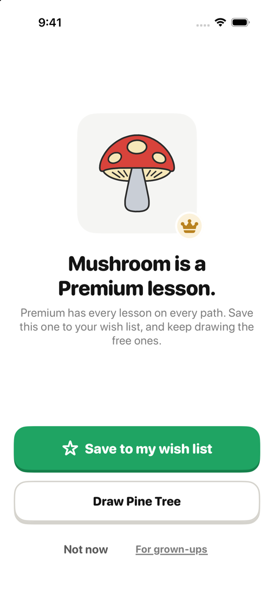
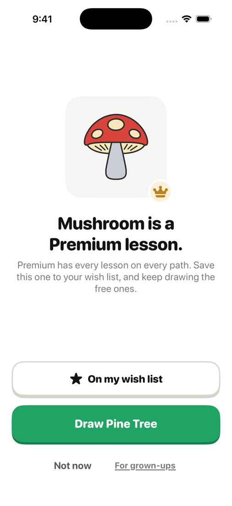
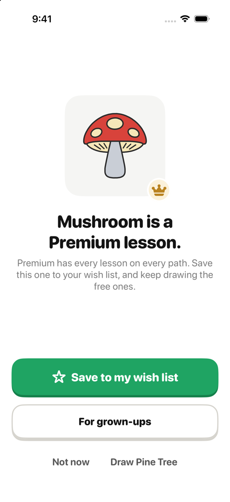
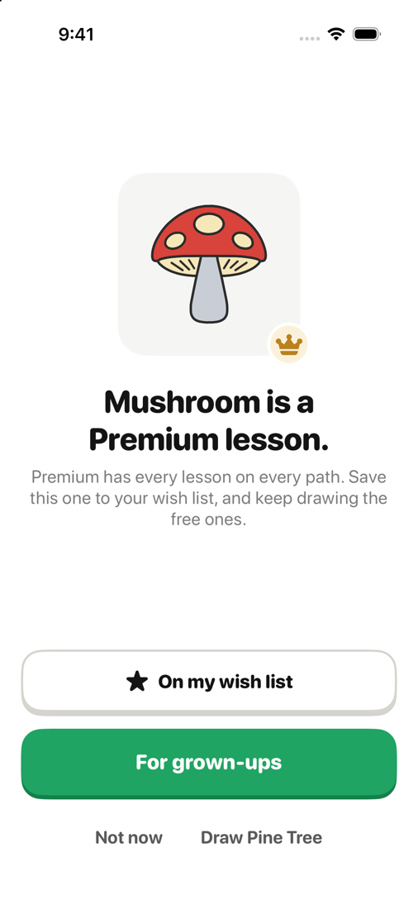
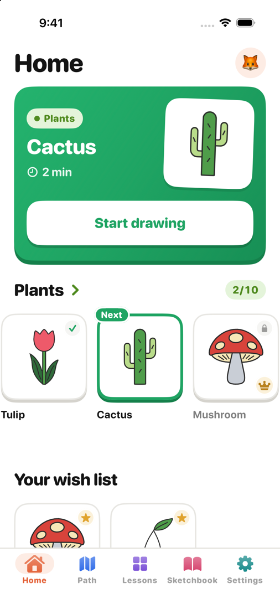
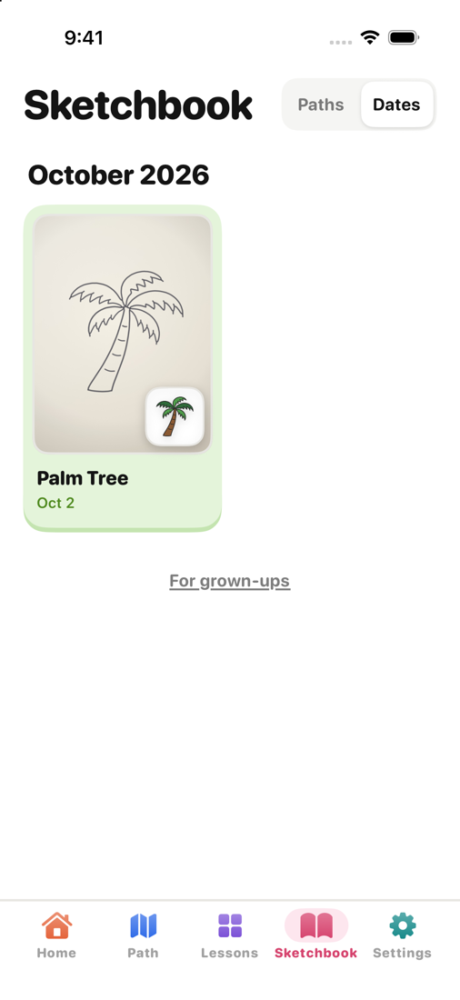
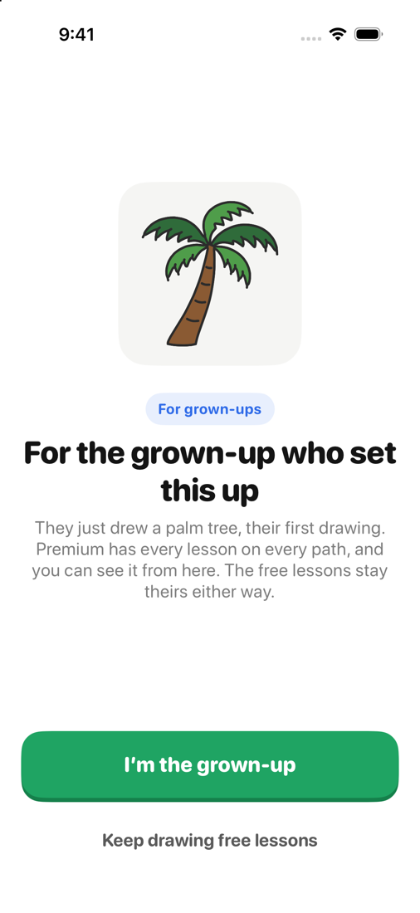
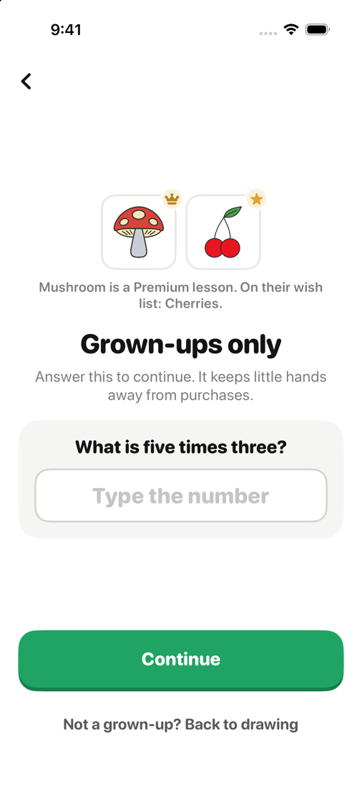
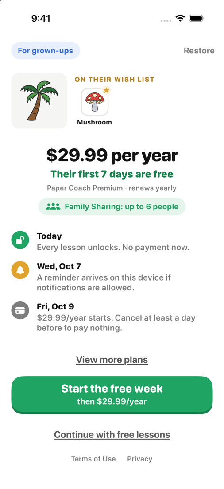

# A child's way to Premium (2026-10-02)

The screens a learner under 13 (or one who gave no age) now meets on the way to Premium, on `main` in `1977f45`
and `2556ed9`, for the build after 1.1. Taken on an iPhone 17 simulator from the debug harness (`-STScreen <name>`,
named under each picture). Nothing here tells the child to ask a grown-up for anything; README › Premium ›
*Children* has the rules and the sources.

## Tapping a crown, the first time

The lesson's card: save it to the wish list, or draw the next free lesson. A small "For grown-ups" leads to the check.

| Before saving (`offer-wish`) | After saving (`offer-wish-saved`) |
| --- | --- |
|  |  |

## Tapping the same crown again

From the second tap on the same lesson, "For grown-ups" takes the free lesson's place as the big second button, and
the free lesson moves beside "Not now".

| Before saving (`offer-wish-again`) | After saving (`offer-wish-again-saved`) |
| --- | --- |
|  |  |

## Home and the sketchbook

Home's "Your wish list" appears once something is saved. Under a child's sketchbook, a small "For grown-ups" goes
straight to the check.

| Home (`home-wish-list`) | Sketchbook (`sketchbook-child`) |
| --- | --- |
|  |  |

## For the grown-up

The end of a child's first run, the parental check (with what the child wanted), and the grown-up's paywall, which
is unchanged.

| End of the first run (`offer-grown-up-setup`) | The check (`offer-parental-check`) | The paywall (`offer-grown-up-paywall`) |
| --- | --- | --- |
|  |  |  |
