# The Studio's Learners page (2026-10-02)

The Learners page (`#/learners`) and its summary on Today, shown with the committed sample
(`STUDIO_LEARNERS_SAMPLE=server/fixtures/learners-sample.json`: PostHog's events for Oct 1 and 2, 2026, release
builds only, ids relabeled). With `POSTHOG_PERSONAL_API_KEY` set, the same page reads PostHog live. Test devices
are left out: every debug build, and every id that carried Apple Ads' test payload.

## How fresh it is

A day that reaches today asks again every minute while the page is in view (a week or a month every five minutes),
and PostHog is asked to work today's numbers out afresh rather than hand back its cached copy. "Refresh" asks at once,
at most every 15 seconds. The app sends its events every 15 seconds and PostHog makes them queryable within a few
minutes, so the page runs about one to three minutes behind the app.

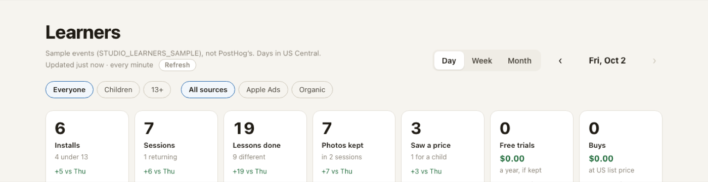

A number that moves flashes when the new value comes in, then stays highlighted with what it moved by ("+2"), for
as long as "Highlight changes" says: 1, 5 (at first), 15 or 30 minutes, or an hour. Hovering over a tile's tag says
from what to what, between which two looks ("17 at 5:22 PM, 19 at 5:23 PM"). The browser remembers the numbers last
seen for each view, so what moved while the page was elsewhere, or closed, is highlighted when it comes back. Today's
summary marks its numbers the same way.

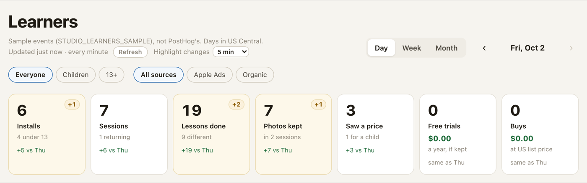

Free trials and Buys are apart: a free week of the yearly plan is a trial, any other plan bought is a buy. Their
dollars are the plans' US list prices on the day (yearly $29.99, weekly $3.99 from Oct 2; $19.99 and $1.99 before;
Lifetime $99.99), before Apple's cut: the app's events name the plan, not the price.

## A day

Seven numbers against the day before, the journey of the day's installs (children and 13+ apart), the lessons drawn
most, then every session as the lessons it drew: green-ringed when finished, dashed where they stopped, gold badges
for a kept photo, a tap on a locked lesson and a wish.

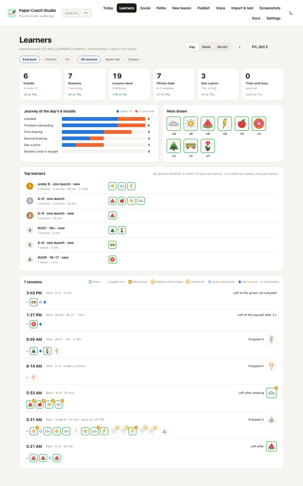

Every learner has an animal on the page (🦊 🐼 🐸…, in the order they first opened the app), the same on their
session, on the leaderboard and in their history. A learner 13 or over keeps theirs from day to day and wears a ring.
It is the page's name for them, not the avatar they chose in the app, which is never sent.

## Narrowing it

A tap on a picture in Most drawn shows only the learners who finished that lesson, and picks it out wherever it was
drawn ("Drew Cloud ✕" undoes it):

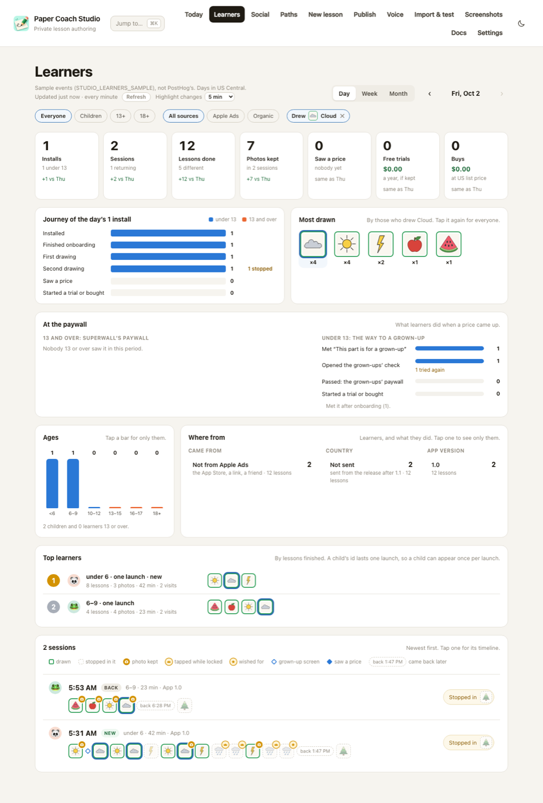

A tap on a number shows only the learners it counts (here, who saw a price); the numbers stay as they are, and
Sessions shows everyone again. Today's numbers and pictures open the page already narrowed.

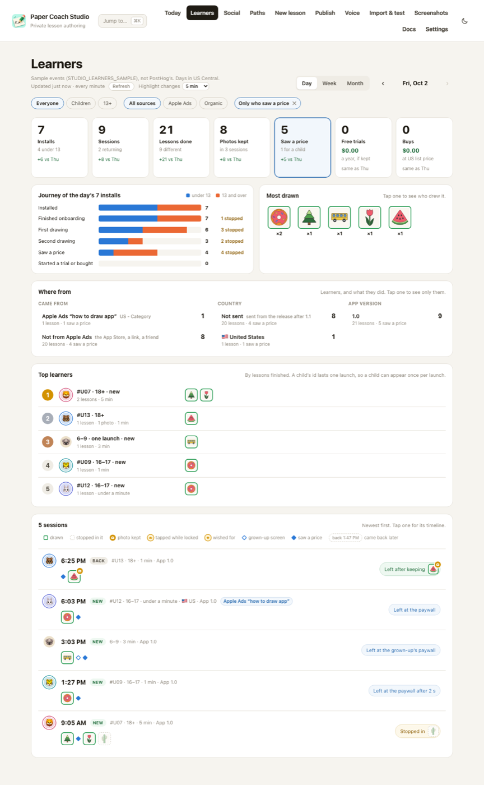

A stage of the journey works the same way: a tap shows the installs who got that far, and "2 stopped" those who got
that far and no further (here, who stopped after one drawing):

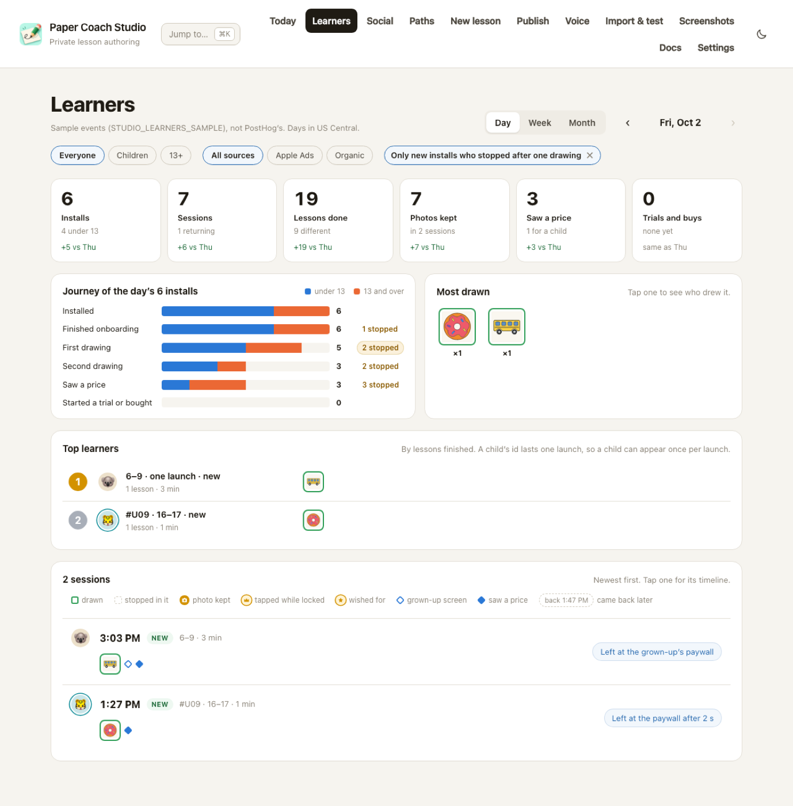

## Top learners

Who finished most lessons in the period, with the lessons as pictures. A child's id lasts one launch, so a child
can appear once per launch; a learner 13 or over carries a short tag (`#3F2A`) cut from their random id.

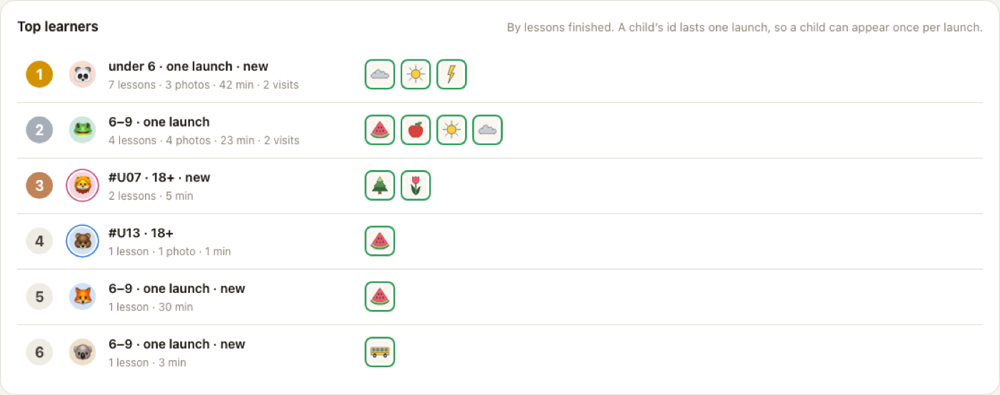

A learner 13 or over opens into every visit they made, up to a year back (here, their only day so far). A day
opens in place, as its timeline, without leaving the page:

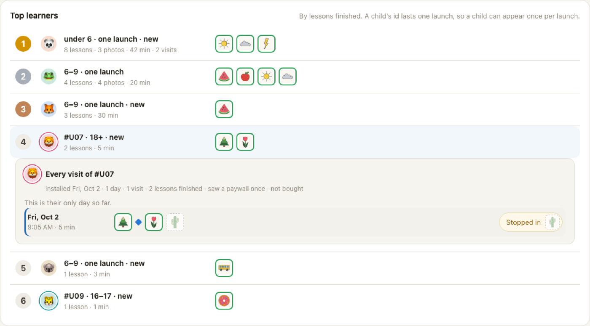

## Sessions

Each row: the learner's animal; the time, New or Back, and who they are on one line; what they drew under it, from
the same edge; where it ended in a pill on the right (green for something done, amber where they stopped, blue at a
price or a grown-up's screen).

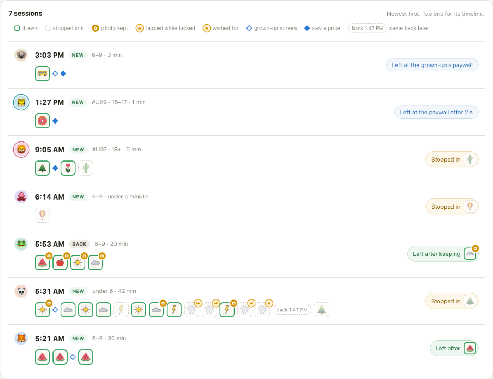

## One session opened

A tap on a row opens it as a timeline in words, each lesson beside its picture; for a learner 13 or over, their
other visits follow.

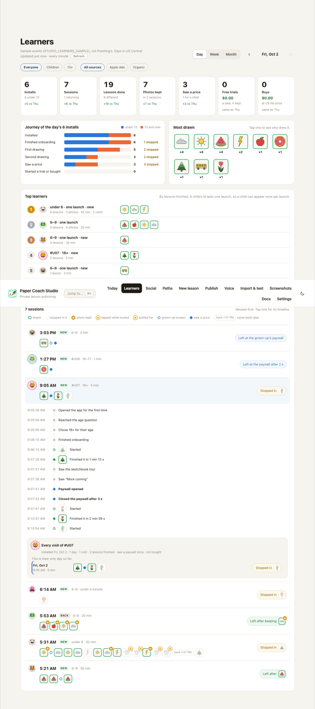

## A week and a month

One column per day: lessons finished, installs, and the lesson drawn most. A day opens its session list.

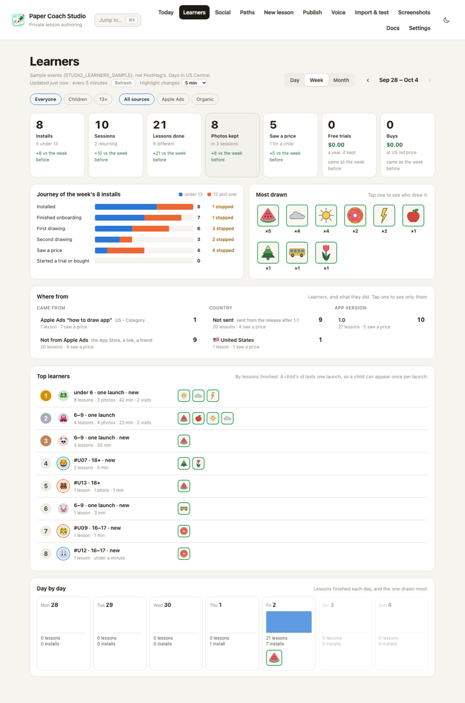

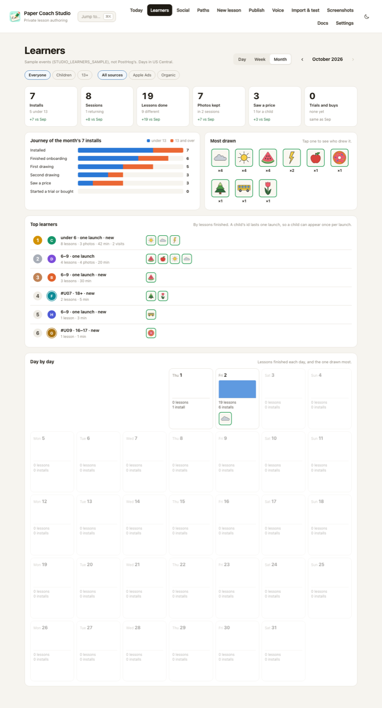

## On Today

The day's numbers and its most drawn lessons, with "Every session ›" to the page. Here alone, since this Mac has no
`status.json`; on m4-1 it sits under Today's Numbers.

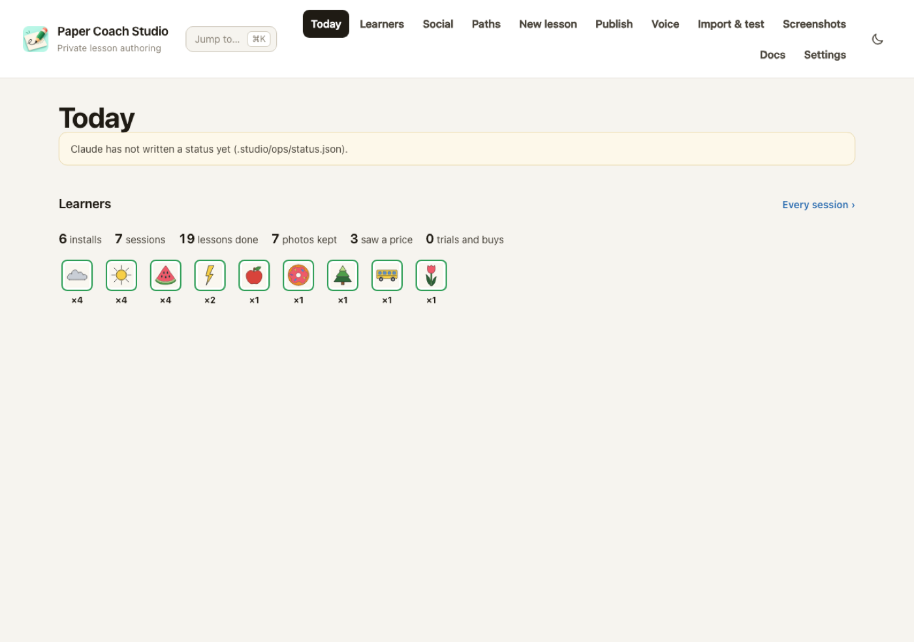

## Dark, and on a phone

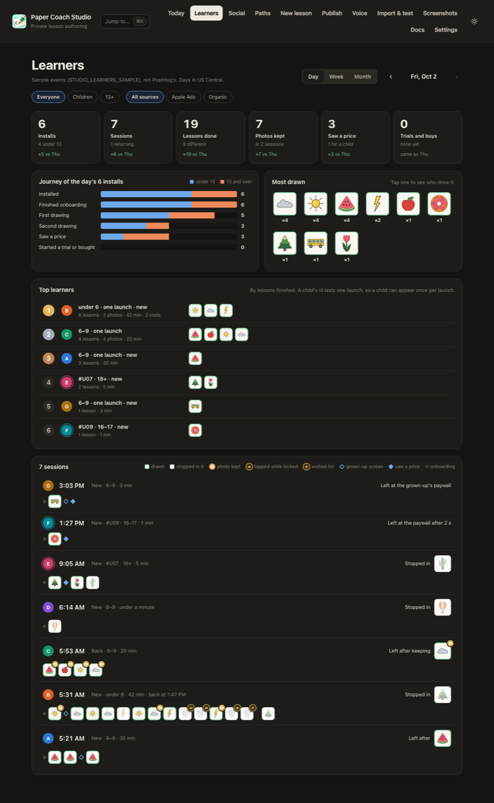

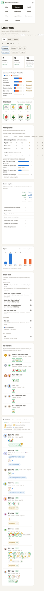
