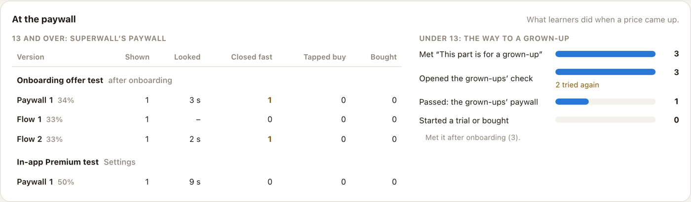
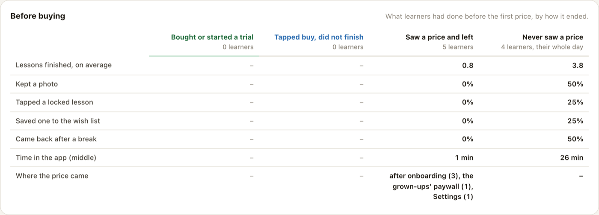
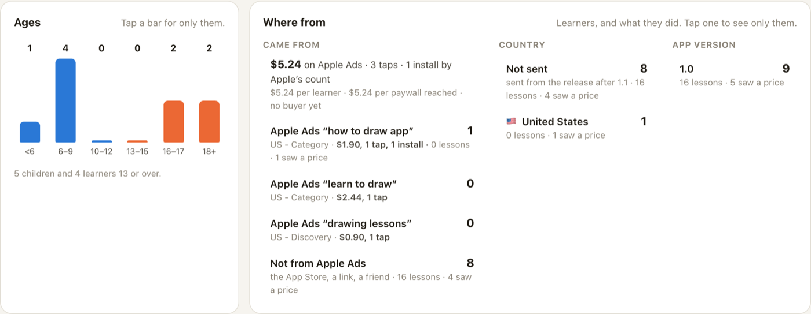
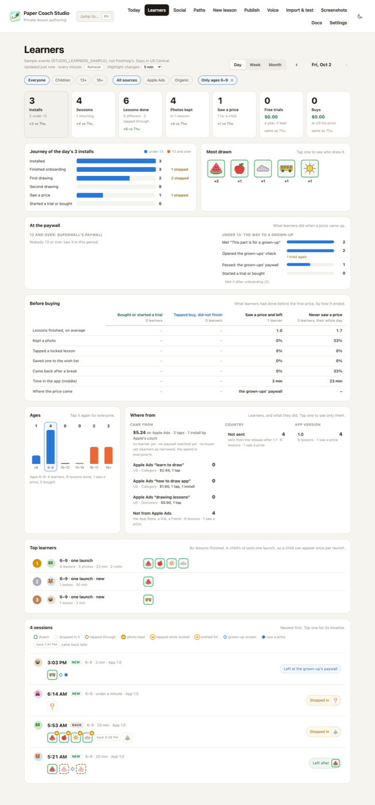
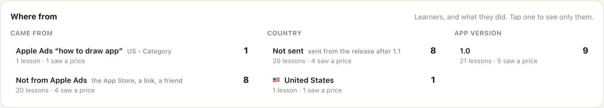
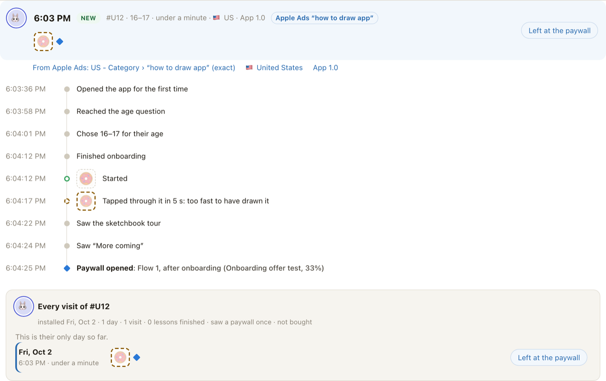
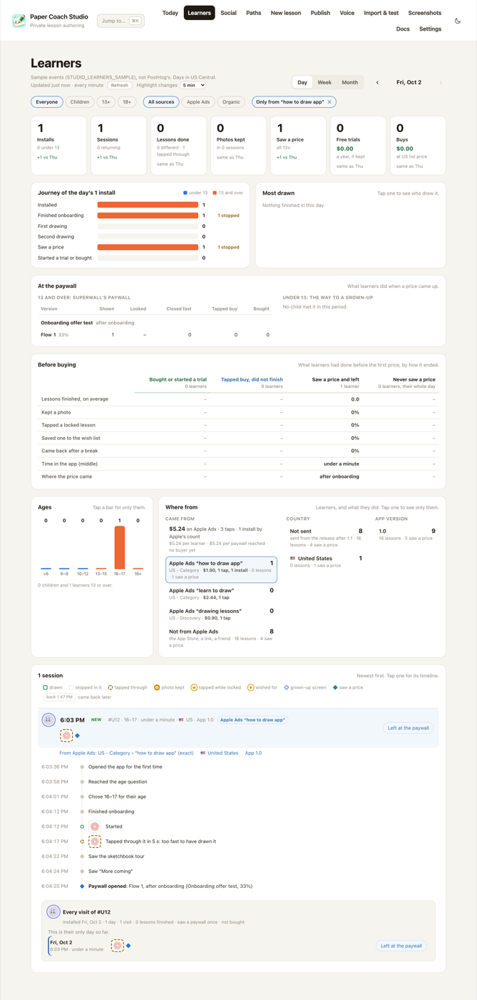

# The Studio's Learners page (2026-10-02)

The Learners page (`#/learners`) and its summary on Today, shown with the committed sample
(`STUDIO_LEARNERS_SAMPLE=server/fixtures/learners-sample.json`: PostHog's events for Oct 1, and Oct 2 until 6:30 PM,
2026, release builds only, ids relabeled). With `POSTHOG_PERSONAL_API_KEY` set, the same page reads PostHog live. Test devices
are left out: every debug build, and every id that carried Apple Ads' test payload.

## How fresh it is

A day that reaches today asks again every minute while the page is in view (a week or a month every five minutes),
and PostHog is asked to work today's numbers out afresh rather than hand back its cached copy. "Refresh" asks at once,
at most every 15 seconds. The app sends its events every 15 seconds and PostHog makes them queryable within a few
minutes, so the page runs about one to three minutes behind the app.

A number that moves flashes when the new value comes in, then stays highlighted with what it moved by ("+2"), for
as long as "Highlight changes" says: 1, 5 (at first), 15 or 30 minutes, or an hour. Hovering over a tile's tag says
from what to what, between which two looks ("17 at 5:22 PM, 19 at 5:23 PM"). The browser remembers the numbers last
seen for each view, so what moved while the page was elsewhere, or closed, is highlighted when it comes back. Today's
summary marks its numbers the same way.

Free trials and Buys are apart: a free week of the yearly plan is a trial, any other plan bought is a buy. Their
dollars are the plans' US list prices on the day (yearly $29.99, weekly $3.99 from Oct 2; $19.99 and $1.99 before;
Lifetime $99.99), before Apple's cut: the app's events name the plan, not the price.

## A day

Seven numbers against the day before, the journey of the day's installs (children and 13+ apart), the lessons drawn
most, then every session as the lessons it drew: green-ringed when finished, dashed where they stopped, gold badges
for a kept photo, a tap on a locked lesson and a wish.

Every learner has an animal on the page (🦊 🐼 🐸…, in the order they first opened the app), the same on their
session, on the leaderboard and in their history. A learner 13 or over keeps theirs from day to day and wears a ring.
It is the page's name for them, not the avatar they chose in the app, which is never sent.

## Narrowing it

A tap on a picture in Most drawn shows only the learners who finished that lesson, and picks it out wherever it was
drawn ("Drew Cloud ✕" undoes it):

A tap on a number shows only the learners it counts (here, who saw a price); the numbers stay as they are, and
Sessions shows everyone again. Today's numbers and pictures open the page already narrowed.

A stage of the journey works the same way: a tap shows the installs who got that far, and "2 stopped" those who got
that far and no further (here, who stopped after one drawing):

## At the paywall

What learners did when a price came up. For 13 and over, Superwall's paywall, test by test and version by version
(with its share of the traffic): how often it was shown, the middle time it stayed open, how often it was closed
within 5 seconds (amber: dismissed, not read), how often buy was tapped (Apple's payment sheet came up, and how often
it was cancelled there), and purchases. For children, the way to a grown-up: "This part is for a grown-up", the
grown-ups' check (and who tried it again), the grown-ups' paywall, a purchase. Names come from Superwall
(`superwall … --project 42098`). The A/B test is still judged in Superwall, by purchases per open; this shows the way
there, and an opened session names the version it saw ("Paywall opened: Flow 1, after onboarding (Onboarding offer
test, 33%)").

## Before buying

What learners had done before the first price came up, side by side for those who bought or started a free week, who
tapped buy and did not finish, who saw a price and left, and (over their whole day, to compare with) who never saw one:
lessons finished, a photo kept, a locked lesson tapped, a wish, a break and a return, time in the app, and where the
price came. Restoring purchases is not trying to buy.

## Ages

The period's learners by the age band they gave (children blue, 13 and over orange; "not said" and "no answer" in
gray when anyone is in them). A bar shows only that band, and the rest of the page follows: here, ages 6–9. The
chart stays whole, so another band is a tap away, and it follows the other narrowings, so with a keyword picked it
shows the ages that keyword brought. Beside 13+, the Who chips have **18+**.

## Where from

Where the period's learners came from, and what they did: Apple Ads keyword by keyword against the rest, their
country and their app version. Apple tells the app which campaign, ad group and keyword brought an install, and the
app sends their ids; the Studio names them through `superwall asa` (the CLI signed in on its machine; without it,
the ids). A row shows only its learners and stays put, so the next one is a tap away.

Above the keywords, Apple Ads in all for the period: what it spent, its taps and installs (Apple's count), and what
each learner, paywall reached and buyer cost. Each keyword shows what it spent and got beside the learners it brought,
and a keyword that spent money but brought nobody here has its row too (0). Apple's keyword reports, through
`superwall asa reports … --time-zone ORTZ` (the ads account counts days in US Central, as the page does); what a
campaign spent outside its keywords is its Search Match.

The country is the phone's Region (`device_region`), which the app sends from the release after 1.1; until then
only an Apple Ads install has one, the ad's storefront. Never a city: the app sends no location.

A session says the same on its row, and in full when opened (campaign, ad group if it says more, keyword and its
match), each a way to see only learners like them:

## Top learners

Who finished most lessons in the period, with the lessons as pictures. A child's id lasts one launch, so a child
can appear once per launch; a learner 13 or over carries a short tag (`#3F2A`) cut from their random id.

A learner 13 or over opens into every visit they made, up to a year back (here, their only day so far). A day
opens in place, as its timeline, without leaving the page:

## Sessions

Each row: the learner's animal; the time, New or Back, and who they are on one line; what they drew under it, from
the same edge; where it ended in a pill on the right (green for something done, amber where they stopped, blue at a
price or a grown-up's screen).

## One session opened

A tap on a row opens it as a timeline in words, each lesson beside its picture; for a learner 13 or over, their
other visits follow.

## A week and a month

One column per day: lessons finished, installs, and the lesson drawn most. A day opens its session list.

## On Today

The day's numbers and its most drawn lessons, with "Every session ›" to the page. Here alone, since this Mac has no
`status.json`; on m4-1 it sits under Today's Numbers.

## Dark, and on a phone

